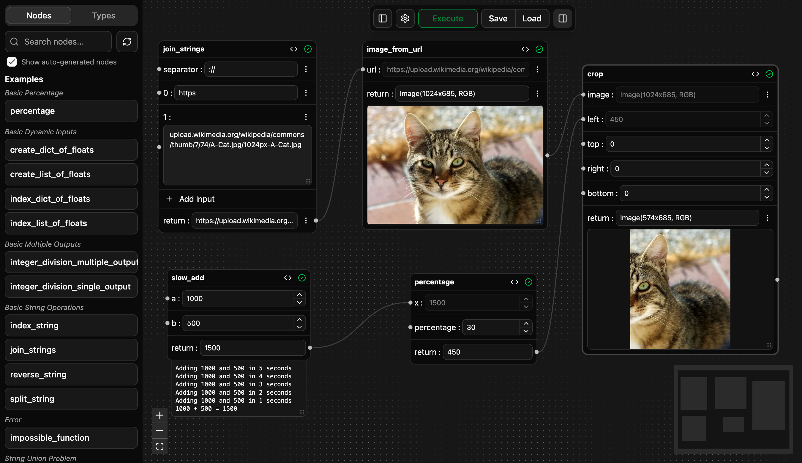

### Python Node Editor (PNE)

Let's say your python project is too flexible or modular to keep re-writing a frontend for it. Or maybe you don't want to keep looking at code while you're running some python functions you wrote while you tweak the inputs. PNE allows you to run your functions from a graphical interface, and string them together into a pipeline.

The interface above is generated by running PNE's main tool on a set of user-defined, type annotated python functions. Within the central "node graph" you can easily pipe the outputs of one function into the inputs of another, or populate the inputs manually.

Please See the [Installation](https://github.com/tristanryerparke/python-node-editor/wiki/Installation) wiki page to get started.
