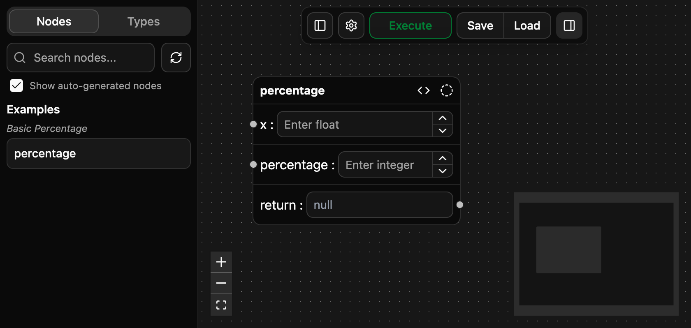

This guide expects you have installed PNE using one of the methods shown in [Installation](https://github.com/tristanryerparke/python-node-editor/wiki/Installation).

Here's a sample typed function in [basic_percentage.py](https://github.com/tristanryerparke/python-node-editor/blob/main/examples/basic_percentage.py) that calculates a percentage of the given number x.
```python
def percentage(x: float, percentage: int) -> float:
    return x * (percentage / 100)
```

Now, if you run `uv run pne examples/basic_percentage.py`, you'll notice the following output:
```
Frontend available at: http://127.0.0.1:8000
INFO:     Started server process [40916]
INFO:     Waiting for application startup.
Found 1 functions and 2 types
INFO:     Application startup complete.
INFO:     Uvicorn running on http://127.0.0.1:8000 (Press CTRL+C to quit)
```

Navigate to the frontend url to see the node-editor interface.
Drag the "percentage" node onto the canvas and you should see the following:



Type in `50` in the "x" field and `25` in the "percentage" field, press the execute button and you should see a result of `12.5`.

This means the backend just ran your python program using the arguments you set via the graphical interface, and displayed the result:


Now, drag a second percentage node to the canvas and attach the output from the first node into the `x` input field on the new node.
Configure the percentage field as `50%` and run the code. You should get this result:


Based on the connection (or edge) that you made, the backend piped the output of the first node into the input of the second node, ran both, and posted the results back to the frontend.

In the terminal process, you can see that the frontend made some calls to submit your data and gather the results:
```
INFO:     127.0.0.1:51843 - "POST /execution_submit HTTP/1.1" 200 OK
INFO:     127.0.0.1:51843 - "GET /execution_update/ivB2WUmV9b54KhNCoaaTr9 HTTP/1.1" 200 OK
INFO:     127.0.0.1:51843 - "POST /execution_submit HTTP/1.1" 200 OK
INFO:     127.0.0.1:51843 - "GET /execution_update/ZpCxJpoFcChn6ZHjoWBTuR HTTP/1.1" 200 OK
```

Notice how there is a submission request and an update request for each node. This is due to the default execution mode being `async` which provides the frontend with the ability to update the UI as the backend processes your functions as nodes. For more information on `sync`/`async` execution modes, see the (Not written yet page).
